We need to load several libraries in order to run this code. Each library contain several functions; e.g., the **ggplot2** library contains the `ggplot()` function for plotting, and **readxl** contains the `read_excel()` function for reading Excel files.

```r
library(ggplot2)
library(ggmap)
library(dplyr)
```

```
## 
## Attaching package: 'dplyr'
```

```
## The following objects are masked from 'package:stats':
## 
##     filter, lag
```

```
## The following objects are masked from 'package:base':
## 
##     intersect, setdiff, setequal, union
```

```r
library(readxl)
library(cowplot)
```

```
## 
## Attaching package: 'cowplot'
```

```
## The following object is masked from 'package:ggmap':
## 
##     theme_nothing
```

```
## The following object is masked from 'package:ggplot2':
## 
##     ggsave
```

# Example of one lake plot (Lake Lura)

## Create background map
This creates a background map from Google that 

```r
mymap <- qmap(location = c(20.19387, 41.78988), zoom=16)
```

```
## Map from URL : http://maps.googleapis.com/maps/api/staticmap?center=41.78988,20.19387&zoom=16&size=640x640&scale=2&maptype=terrain&language=en-EN&sensor=false
```

<b>

### Look at background map
To look at the map, just write the name you gave to it:

```r
mymap
```

<!-- -->

<b>

## Add station positions to map

### Get data set with positions of each station
The data are in an excel file, so we use the command 'read_excel' to read the data into R's memory.

```r
data_positions <- read_excel("Data/STAR-WALK sites.xlsx")
```

<b>
### Plot positions

```r
# Make 'google' map
mymap + 
  geom_point(data = data_positions, aes(Elongitude, Nlatitude), color = "black")
```

```
## Warning: Removed 30 rows containing missing values (geom_point).
```

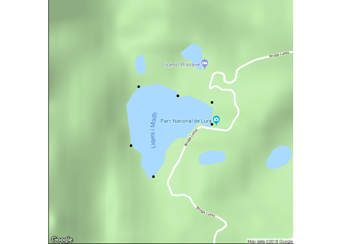<!-- -->

<b>

### Plot posisions and station names


```r
# Make 'google' map
mymap + 
  geom_point(data = data_positions, aes(Elongitude, Nlatitude), color = "black") +
  geom_text(data = data_positions, aes(x = Elongitude + 0.0003, y = Nlatitude, label=site), hjust = "left", color = "black")
```

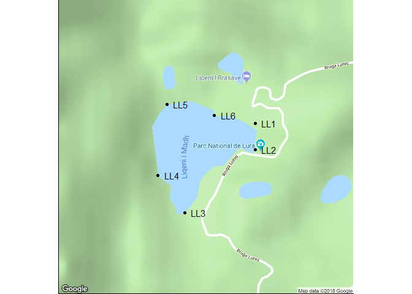<!-- -->

<b>

## Plot chemistry data on map

### Get chemistry data into R's memory

The data are in an excel file, so we use the command 'read_excel' to read the data into R's memory. Note that   

 + `skip = 2` means that we skip the two first lines of the Excel file (we want the variable names to be in our row number 1)  
 + `na = "n.d."` means that the cells with no data are marked "n.d.". Otherwise R will think this is some kind of "data".   

To look at the data and which variables are inside:
 + In RStudio:
    - Click on the **Environment** button in the top right window
    - Click on the small blue button to the left of 'data_chem' to see list of variables
    - Click on the word 'data_chem' to see the data
 +  In R or RStudio:
    - Command `head(data_chem)` - shows the first lines of the file
    - Command `str(data_chem)` - shows a list of the variables
    - Command `summary(data_chem)` - shows minimum, maximum, mean of the variables
    - Command `data_chem` - shows all or the top of the file (depending on type of data)

```r
data_chem <- read_excel("Data/summary of most important chemistry results.xlsx", skip = 2, na = c("","n.d."))
```

<b>

### Add columns for longitude and latitude to the data
We use the command `left_join()` with specifying `by = c("lake","site")`. This means that we take the first data set (`data_diatoms`) and use the two variables _lake_ and _site_ to add the variables form the second data set (`data_positions`). Thus, the variables _Elongitude_ and _Nlatitude_ are added to the `data_diatoms` data.

```r
data_chem <- left_join(data_chem, data_positions, by = c("lake","site"))
```


<b>

### Plot (first try)

```r
mymap + 
  geom_point(data = data_chem, aes(Elongitude, Nlatitude, color = water_TP_autumn))
```

<!-- -->


<b>

### Plot (second try)
We make the points larger by setting `size = 5` 

```r
mymap + 
  geom_point(data = data_chem, aes(Elongitude, Nlatitude, color = water_TP_autumn), size = 5)
```

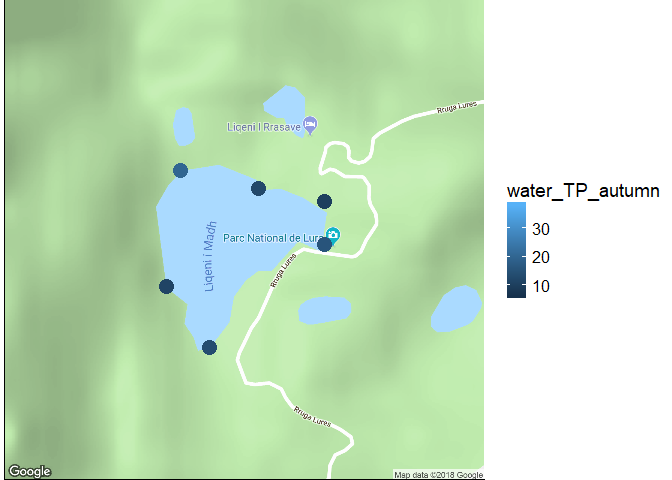<!-- -->


<b>

### Plot (with different color scale)
We use a better color scale by setting `scale_color_distiller(palette = "RdYlGn")`  
  + Note: 'data_chem' has data for _all_ lakes, and the colours scale is adapted to that. But because 'mymap' sets the limits of the map we only see the points around this lake - the other lakes are outside the picture.   

```r
mymap + 
  geom_point(data = data_chem, aes(Elongitude, Nlatitude, color = water_TP_autumn), size = 5) +
  scale_color_distiller(palette = "RdYlGn")
```

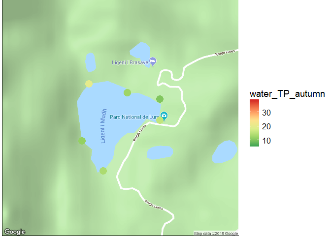<!-- -->


<b>

### Plot (color scale based on this lake only)
To make the colour scale adjust to only the lake we show, we have to make a new data set (we call it 'data_chem_mylake') for only the data of this lake. 

```r
data_chem_mylake <- subset(data_chem, lake == "Lura")
mymap + 
  geom_point(data = data_chem_mylake, aes(Elongitude, Nlatitude, color = water_TP_autumn), size = 5) +
  scale_color_distiller(palette = "RdYlGn")
```

<!-- -->


<b>

### More things we can do to improve our plot
#### Make points more visible by adding a black border
We do this by using 'shape = 21'.
 + Note that we have to change 'color' and 'scale_color_distiller' into 'fill' and 'scale_fill_distiller', because for this shape, 'color' is only the color of the border around the circle.

```r
mymap + 
  geom_point(data = data_chem_mylake, aes(Elongitude, Nlatitude, fill = water_TP_autumn), shape = 21, size = 5) +
  scale_fill_distiller(palette = "RdYlGn")
```

<!-- -->


<b>

#### Change shape
Here we change 'shape = 21' to 'shape = 22'. Run the command `?points` to see the different shapes we can use. 

```r
mymap + 
  geom_point(data = data_chem_mylake, aes(Elongitude, Nlatitude, fill = water_TP_autumn), shape = 22, size = 5) +
  scale_fill_distiller(palette = "RdYlGn")
```

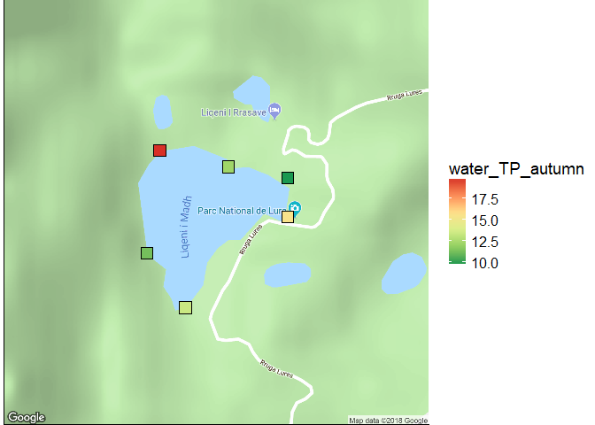<!-- -->

<b>

#### Change title of the legend 
We do this by adding the title just after the first parenthesis in the scale definition `scale_fill_distiller`.  
Note that `\p` means "line shift", so `Total water P\nAutumn` prints "Total water", line shift,  "Autumn". 

```r
mymap + 
  geom_point(data = data_chem_mylake, aes(Elongitude, Nlatitude, fill = water_TP_autumn), shape = 22, size = 5) +
  scale_fill_distiller("Total water P\nAutumn", palette = "RdYlGn")
```

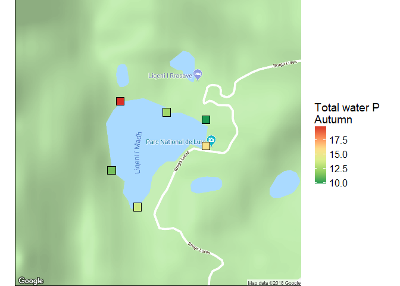<!-- -->

<b>

#### Add plot title 

```r
mymap + 
  geom_point(data = data_chem_mylake, aes(Elongitude, Nlatitude, fill = water_TP_autumn), shape = 22, size = 5) +
  scale_fill_distiller("Total water P\nAutumn", palette = "RdYlGn") + 
  labs(title = "Lake Lura, total phosphorus")
```

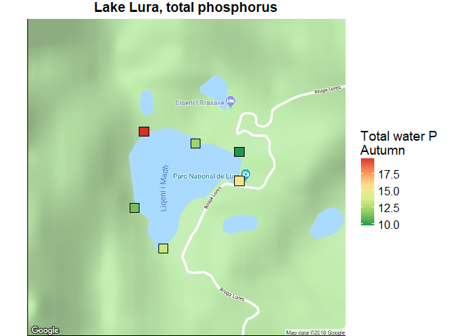<!-- -->

<br>

#### Show variation using point size 
 + Added `size = water_TP_autumn` _inside_ the aes() paranthesis
 + Remember to delete the `size = 5` _outside_ the aes() paranthesis
 + We can also use size to show a different variable

```r
mymap + 
  geom_point(data = data_chem_mylake, aes(Elongitude, Nlatitude, fill = water_TP_autumn, size = water_TP_autumn), shape = 22) +
  scale_fill_distiller("Total water P\nAutumn", palette = "RdYlGn")
```

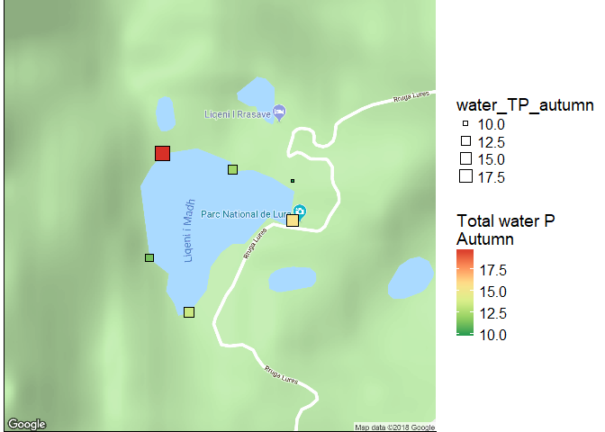<!-- -->

<b>

#### Plot a different variable (sediment total P)
 + Changed `water_TP_autumn` to `sed_TP_autumn`
 + Remember to also change any titles (here, legend title)

```r
mymap + 
  geom_point(data = data_chem_mylake, aes(Elongitude, Nlatitude, fill = sed_TP_autumn), shape = 22, size = 5) +
  scale_fill_distiller("Total sediment P\nAutumn", palette = "RdYlGn")
```

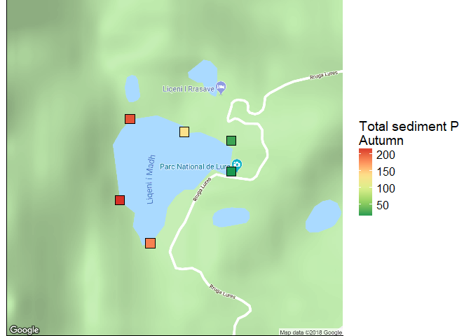<!-- -->


## Plot diatom data

### Get diatom data into R's memory

```r
data_diatoms <- read_excel("Data/summary of the most important diatom results.xlsx", na = c("","n.d."))
```

<b>

### Add columns for longitude and latitude to the data

```r
data_diatoms <- merge(data_diatoms, data_positions, by = c("lake","site"), all.x = TRUE, all.y = FALSE)
```

<b>

### Plot IPS as colours on map

```r
mymap + 
  geom_point(data = data_diatoms, aes(Elongitude, Nlatitude, color = IPS), size = 5) +
  scale_color_distiller(palette = "RdYlGn")
```

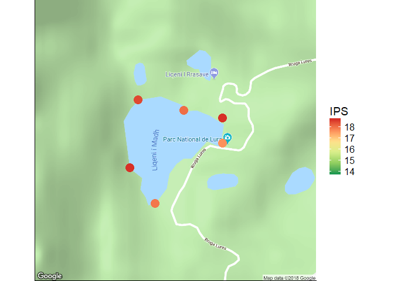<!-- -->

## Plot macroinvertebrate data

<b>

### Get macroinvertebrate data into R's memory

```r
data_invert <- read_excel("Data/summary of most important macroinvertebrate data.xlsx", sheet = "indices_traits", skip = 1, na = c("","n.d."))
```

<b>

### Add columns for longitude and latitude to the data

```r
data_invert <- left_join(data_invert, data_positions, by = c("lake","site"))
```

<b>

### Plot IPS as colours on map

```r
mymap + 
  geom_point(data = data_invert, aes(Elongitude, Nlatitude, color = ASPT), size = 5) +
  scale_color_distiller(palette = "RdYlGn")
```

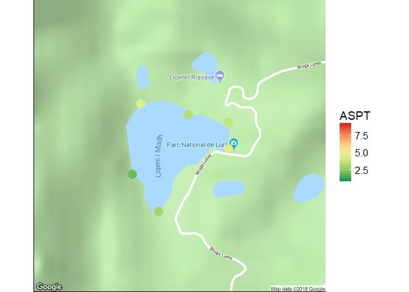<!-- -->

## Plot macrophyte data

### Get macrophyte data into R's memory

```r
data_macrophyte <- read_excel("Data/summary of most important macrophyte results.xlsx", skip = 1, na = c("","n.d."))
```

<b>

### Add columns for longitude and latitude to the data

```r
data_macrophyte <- left_join(data_macrophyte, data_positions, by = c("lake","site"))
```

<b>

### Plot IPS as colours on map

```r
mymap + 
  geom_point(data = data_macrophyte, aes(Elongitude, Nlatitude, color = MI), size = 5) +
  scale_color_distiller(palette = "RdYlGn")
```

<!-- -->

# Make plot of all lakes
## Mean position of each lake

```r
data_positions %>%
  group_by(lake) %>%
  summarise(long = mean(Elongitude), lat = mean(Nlatitude)) %>%
  as.data.frame()
```

<div data-pagedtable="false">
  <script data-pagedtable-source type="application/json">
{"columns":[{"label":["lake"],"name":[1],"type":["chr"],"align":["left"]},{"label":["long"],"name":[2],"type":["dbl"],"align":["right"]},{"label":["lat"],"name":[3],"type":["dbl"],"align":["right"]}],"data":[{"1":"Biogradsko","2":"19.59828","3":"42.89941"},{"1":"Crno","2":"19.09116","3":"43.14590"},{"1":"Lura","2":"20.19387","3":"41.78988"},{"1":"Ohrid","2":"20.73327","3":"41.03089"},{"1":"Prespa","2":"20.95873","3":"40.90712"},{"1":"Sava","2":"20.39183","3":"44.78354"}],"options":{"columns":{"min":{},"max":[10]},"rows":{"min":[10],"max":[10]},"pages":{}}}
  </script>
</div>

<b>

## Create background maps

```r
mymap1 <- qmap(location = c(19.09116, 43.14598), zoom=16)
```

```
## Map from URL : http://maps.googleapis.com/maps/api/staticmap?center=43.14598,19.09116&zoom=16&size=640x640&scale=2&maptype=terrain&language=en-EN&sensor=false
```

```r
mymap2 <- qmap(location = c(19.5983, 42.898), zoom=16)
```

```
## Map from URL : http://maps.googleapis.com/maps/api/staticmap?center=42.898,19.5983&zoom=16&size=640x640&scale=2&maptype=terrain&language=en-EN&sensor=false
```

```r
mymap3 <- qmap(location = c(20.39183, 44.78354), zoom=14)
```

```
## Map from URL : http://maps.googleapis.com/maps/api/staticmap?center=44.78354,20.39183&zoom=14&size=640x640&scale=2&maptype=terrain&language=en-EN&sensor=false
```

```r
mymap4 <- qmap(location = c(20.19387, 41.78988), zoom=16)
```

```
## Map from URL : http://maps.googleapis.com/maps/api/staticmap?center=41.78988,20.19387&zoom=16&size=640x640&scale=2&maptype=terrain&language=en-EN&sensor=false
```

```r
mymap5 <- qmap(location = c(20.73327, 41.03089), zoom=11)
```

```
## Map from URL : http://maps.googleapis.com/maps/api/staticmap?center=41.03089,20.73327&zoom=11&size=640x640&scale=2&maptype=terrain&language=en-EN&sensor=false
```

```r
mymap6 <- qmap(location = c(20.95873, 40.90712), zoom=11)
```

```
## Map from URL : http://maps.googleapis.com/maps/api/staticmap?center=40.90712,20.95873&zoom=11&size=640x640&scale=2&maptype=terrain&language=en-EN&sensor=false
```

<b>

## Create a list of maps and arrange them
We make a list of maps (`map_list`) and print it using `plot_grid`.

```r
map_list <- list(mymap1, mymap2, mymap3, mymap4, mymap5, mymap6)
plot_grid(plotlist = map_list, ncol = 2)
```

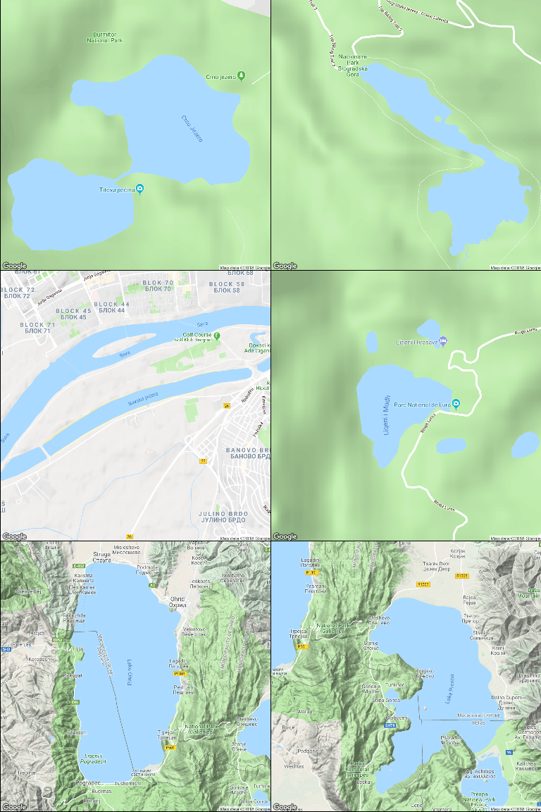<!-- -->

<b>

## Create a list of maps, add points, and arrange them
We first make a list of 6 maps as before. We then make a loop that goes through the numbers 1 to 6 (represnted by _i_), and for each round in the loop we pick map number _i_ and add the data points just as before.

```r
map_list <- list(mymap1, mymap2, mymap3, mymap4, mymap5, mymap6)
  
for (i in 1:6){
  map_list[[i]] <- map_list[[i]] +
    geom_point(data = data_chem, aes(Elongitude, Nlatitude, fill = water_TP_autumn), pch = 21, size = 5) +
    scale_fill_distiller("Total water P\nAutumn", palette = "RdYlGn")
}
```

<b>

### Plot this new list of maps

```r
plot_grid(plotlist = map_list, ncol = 2)
```

<!-- -->

<b>

## Plot only points for the correct lake  
 + Inside `geom_point`, we replace `data_chem` with `subset(data_chem, lake == lakes[i])`  
 + Note that in order to keep the same color scale for all plots, we need to add
    - `total_range <- range...` where we find the minimum/maximum of `water_TP_autumn`and store it in `total_range`
    - `limits = total_range` inside `scale_fill_distiller`; this sets all color scales to go between the same minimum/maximum  

```r
map_list <- list(mymap1, mymap2, mymap3, mymap4, mymap5, mymap6)
lakes <- c("Crno","Biogradsko","Sava","Lura","Ohrid","Prespa")
total_range <- range(data_chem$water_TP_autumn, na.rm = TRUE)
for (i in 1:6){
  map_list[[i]] <- map_list[[i]] +
    geom_point(data = subset(data_chem, lake == lakes[i]), aes(Elongitude, Nlatitude, fill = water_TP_autumn), pch = 21, size = 5) +
    scale_fill_distiller("Total water P\nAutumn", palette = "RdYlGn", limits = total_range)
}
```

<b>

### Plot this new list of maps

```r
plot_grid(plotlist = map_list, ncol = 2)
```

<!-- -->
